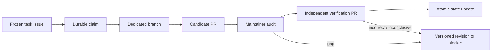

# ProofRelay Template

[简体中文](README.zh-CN.md)

ProofRelay is a public GitHub template for evidence-first collaboration among humans, AI agents, reviewers, and compute workers. It turns research work into auditable, versioned units without pretending that a merged pull request is the same thing as a verified result.

This repository is a public demonstration of Euler Agent's mini mode.

It is suitable for theorem proving, scientific software, benchmark studies, data investigations, security research, and other projects where a claim must survive independent checking.

## What this template enforces

- GitHub is the authoritative work surface; chat is only a routing channel.
- Every work unit begins with a frozen target, exact scope, allowed inputs, and stop conditions.
- A durable Issue claim, dedicated branch, or pull request is required before work is considered started.
- Candidate authors and verifiers use separate branches and separate pull requests.
- Verification is commit-pinned and context-isolated; the claimed isolation level is recorded honestly.
- Proof, computation, formalization, reproducibility, and novelty have separate statuses.
- Finite `NO_HIT` results are never promoted to general proofs without a coverage argument.
- State changes update the machine ledger and human ledger together.
- Failures and superseded attempts remain in history.
- Receipts record commands, environments, exit codes, search denominators, and hashes without leaking infrastructure details.

## The lifecycle



Merging preserves an artifact. Only an explicit, reviewed update to `state/PROJECT_STATE.json` and `state/STATUS.md` changes the project's accepted status.

## Start a project

1. Click **Use this template** on GitHub.
2. Follow [Setup](docs/setup.md) and replace every `REPLACE_ME` value.
3. Freeze the target in [contracts/frozen-target.md](contracts/frozen-target.md).
4. Set the acceptance and verification policy in [state/PROJECT_STATE.json](state/PROJECT_STATE.json).
5. Run:

   ```text
   python scripts/validate_repo.py
   python -m unittest discover -s tests -v
   ```

6. Enable branch protection and require the `validate` workflow.
7. Create the first task with the bilingual **Frozen work unit** Issue form.

The repository has no runtime dependencies beyond Python's standard library. CI uses the official [`actions/checkout@v6`](https://github.com/actions/checkout) and [`actions/setup-python@v6`](https://github.com/actions/setup-python) major releases.

## Repository map

| Path | Purpose |
|---|---|
| `contracts/` | Frozen target and non-negotiable task boundaries |
| `state/` | Machine and human status ledgers |
| `routes/` | Route registry and route-local work |
| `attempts/` | Candidate arguments, implementations, and receipts |
| `verifications/` | Immutable candidate bundles and independent verdicts |
| `evidence/` | Reproducible scripts, outputs, and exact certificates |
| `manifests/` | Artifact hashes and preservation metadata |
| `templates/` | Copyable work-unit, attempt, and verification contracts |
| `.github/` | Bilingual Issue forms, PR checklist, and CI |
| `scripts/` | Scaffolding, validation, manifest, and label helpers |

## Core documents

- [Collaboration discipline](docs/discipline.md)
- [End-to-end workflow](docs/workflow.md)
- [Status model](docs/status-model.md)
- [Independent verification](docs/verification.md)
- [Evidence and compute receipts](docs/evidence.md)
- [Governance and authority](docs/governance.md)
- [Why the gates exist](docs/design-rationale.md)

## Scope and limits

ProofRelay supplies a collaboration protocol, not a truth oracle. It cannot guarantee mathematical correctness, scientific validity, novelty, security, or publication readiness. It makes claims, inputs, decisions, and evidence easier to inspect and harder to silently blur.

## License

[MIT](LICENSE). Project-specific papers, datasets, and third-party artifacts may require separate licenses; do not add them unless redistribution is permitted.
