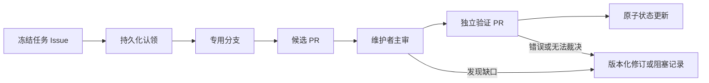

# ProofRelay 模板

[English](README.md)

ProofRelay 是一个可公开使用的 GitHub 模板，用于组织人类、AI 智能体、审稿者和计算工作者之间的证据优先协作。它把研究任务拆成可审计、可版本化的工作单元，同时明确：合并 Pull Request 不等于结果已经被验证。

它适用于定理证明、科研软件、基准评测、数据调查、安全研究，以及其他需要独立核验主张的项目。

## 模板强制的原则

- GitHub 是正式工作面；聊天只负责路由。
- 每个工作单元先冻结目标、精确范围、允许输入和停止条件。
- 至少出现可持久核验的 Issue 认领、专用分支或 PR，才算真正启动。
- 候选作者与验证者使用不同分支、不同 PR。
- 验证绑定完整 commit，并诚实记录上下文隔离等级。
- 证明、计算、形式化、可复现性和新颖性分别记账。
- 有限 `NO_HIT` 没有完备覆盖证明时，绝不升级成一般证明。
- 机器状态账与人读状态账必须同时更新。
- 失败和被取代的尝试保留在历史中。
- 运行收据记录命令、环境、退出码、搜索分母与哈希，同时去除基础设施秘密。

## 生命周期



合并只表示工件已保全。只有明确、经审查地同步修改 `state/PROJECT_STATE.json` 与 `state/STATUS.md`，才表示项目接受状态发生变化。

## 开始新项目

1. 在 GitHub 点击 **Use this template**。
2. 按照[初始化说明](docs/setup.zh-CN.md)替换全部 `REPLACE_ME`。
3. 在 [contracts/frozen-target.zh-CN.md](contracts/frozen-target.zh-CN.md) 冻结目标，并同步英文权威版本。
4. 在 [state/PROJECT_STATE.json](state/PROJECT_STATE.json) 设置验收与验证策略。
5. 运行：

   ```text
   python scripts/validate_repo.py
   python -m unittest discover -s tests -v
   ```

6. 启用分支保护，并把 `validate` 设为必需检查。
7. 用双语 **Frozen work unit** Issue 表单建立第一项任务。

仓库运行时只依赖 Python 标准库。

## 目录

| 路径 | 用途 |
|---|---|
| `contracts/` | 冻结目标与不可擅改的任务边界 |
| `state/` | 机器可读和人读状态账 |
| `routes/` | 路线注册与路线内部工件 |
| `attempts/` | 候选论证、实现和运行收据 |
| `verifications/` | 不可变候选包与独立裁决 |
| `evidence/` | 可复现程序、输出和精确证书 |
| `manifests/` | 工件哈希与保全元数据 |
| `templates/` | 可复制的工作单元、尝试和验证契约 |
| `skills/` | 可安装的 agent skill 及安装说明 |
| `.github/` | 双语 Issue 表单、PR 检查表和 CI |
| `scripts/` | 脚手架、校验、清单和标签工具 |

## 核心文档

- [协作纪律](docs/discipline.zh-CN.md)
- [端到端工作流](docs/workflow.zh-CN.md)
- [状态模型](docs/status-model.zh-CN.md)
- [独立验证](docs/verification.zh-CN.md)
- [证据与计算收据](docs/evidence.zh-CN.md)
- [治理与权限](docs/governance.zh-CN.md)
- [这些门为何存在](docs/design-rationale.zh-CN.md)
- [Agent skill 安装说明](skills/README.zh-CN.md)

## 能力边界

ProofRelay 提供的是协作协议，不是真值机器。它不能保证数学正确、科学有效、新颖、安全或达到发表标准；它做的是让主张、输入、决策和证据更容易检查，也更难被悄悄混淆。

## 许可证

[MIT](LICENSE)。项目自行加入的论文、数据集和第三方工件可能有不同许可；没有再分发授权时不得放入仓库。
